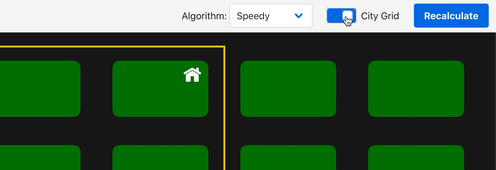
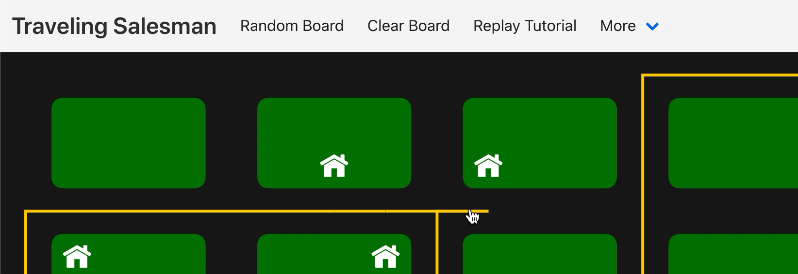

# Real-time Traveling Salesman Visualizer

## What is the traveling salesman problem?

How can Amazon deliver toilet paper in 2 days? This isn't a simple problem. At the very last stretch, Amazon loads your toilet paper into a van. But that van has dozens of other deliveries. So Amazon needs to **find the shortest route between every house**. Finding that shortest route is the traveling salesman problem.

## Add, move, or remove houses…

- **Add houses**: Click somewhere empty to add a house
- **Move houses**: Click and drag to move it around
- **Remove houses**: Just click a house and it's gone

## …and the route updates in real-time!

Unlike most traveling salesman visualizers, this one updates in real-time. Explore how **minor movements can cause massive changes**.

## Choose your algorithm wisely…

Select an algorithm from the dropdown menu.

- **Brute** Force: Checks every possible path, guarantees shortest path
- **Greedy**: Each house connects with the next closest house
- **Annealing**: Gradually improves through random changes, avoids local mins
- **2-opt**: Chooses random path, then uncrosses intersections
- **Speedy**: Custom algorithm, combines greedy, annealing, and 2-opt
- **BOGO**: Chooses random path, odds of finding shortest path is 1:(n - 1)!

## …because some are just better than others.

Some take way too long to finish. Others find paths that are way too long. Choose wisely or you'll have to wait until the heat death of the universe for an answer.

## Choose your own reality.

Find the shortest route through some bustling suburbs, or test the limits of the algorithms on a lifeless, theoretical void. The choice is yours!

## Explore this simulation in depth

Learn the specifics behind each algorithm.

Check out the code on Github (and star the repo).

[Now start exploring! Ready, set, go…](https://traveling-salesman.nickmazuk.com/)
